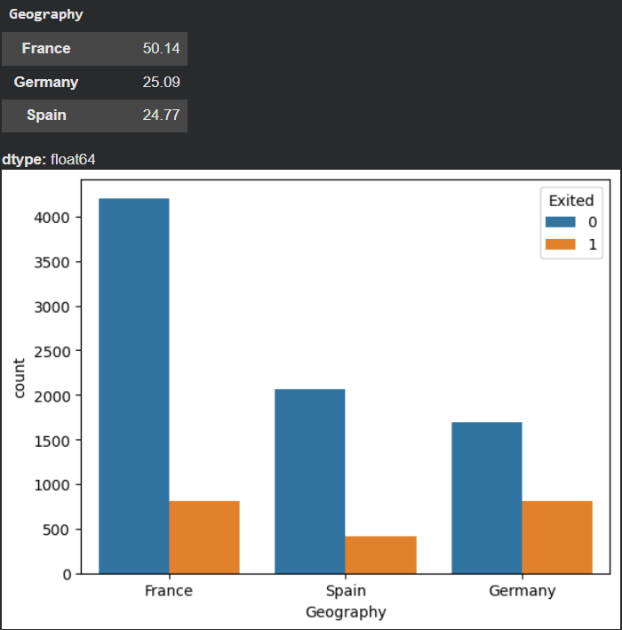
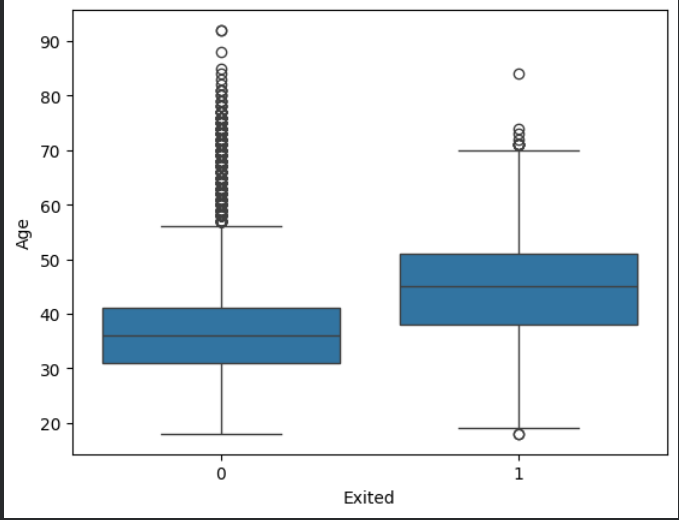
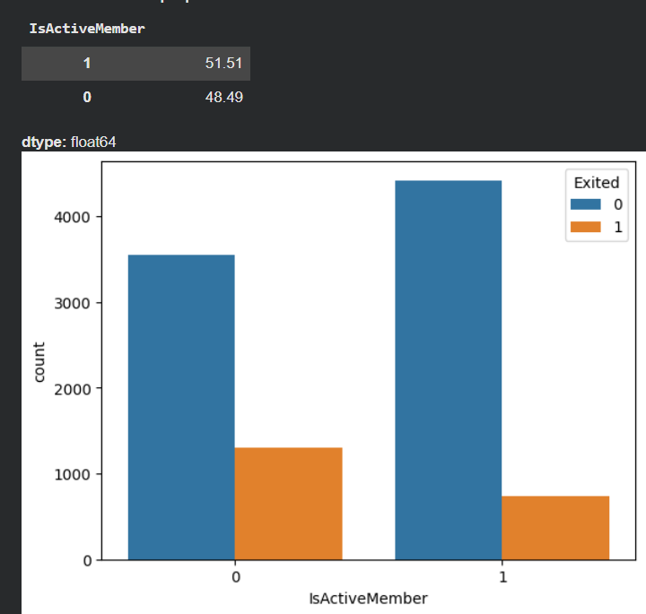
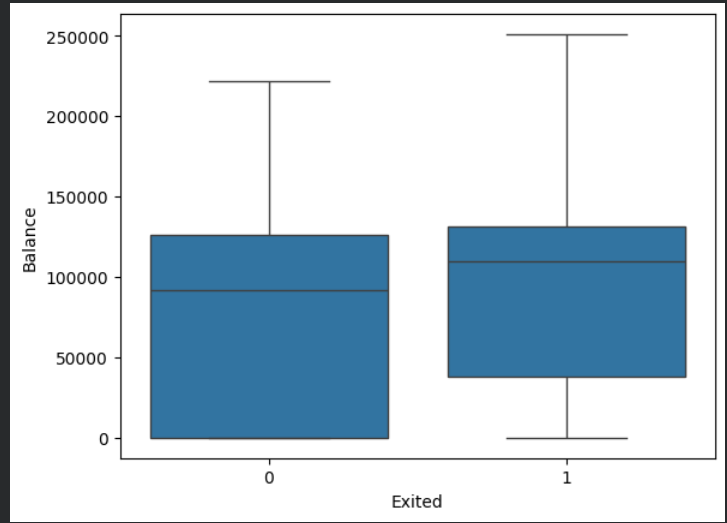
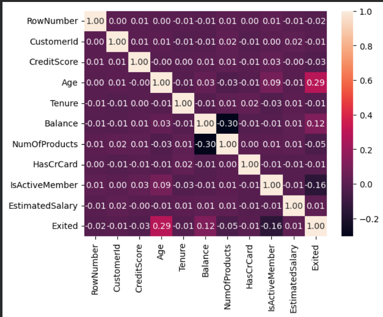
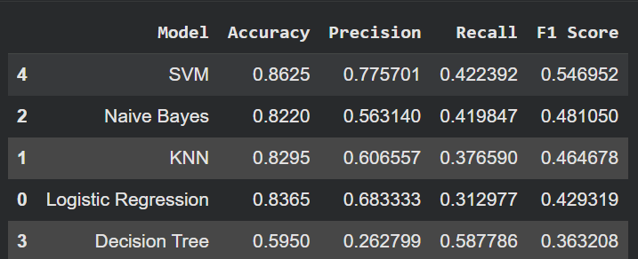

# 🏦 Bank Customer Churn Prediction

## 📌 Project Overview

This project predicts whether a bank customer is likely to churn using the **Churn_Modelling.csv** dataset. The objective is to identify customers who are at risk of leaving the bank so that proactive customer retention strategies can be implemented.

---

## 🎯 Business Objective

Develop and compare multiple machine learning classification models to predict customer churn (`Exited`). The final model is selected based on its overall performance, with particular emphasis on identifying customers who are likely to churn.

---

## 📂 Repository Structure

```
g/
│
├── notebook/
│   └── Bank_Customer_Churn.ipynb
│
├── data/
│   └── Churn_Modelling.csv
│
├── images/
│   ├── summary_statistics.png
│   ├── feature_distributions.png
|   ├── geography_churn.png
|   ├── age_vs_churn.png
|   ├── active_member_churn.png
|   ├── gender_churn.png
|   ├── balance_vs_churn.png
│   ├── correlation_heatmap.png
│   ├── model_comparison.png
│   └── classification_report_for_tuned_SVM.png
│
├── requirements.txt
├── LICENSE
└── README.md
```

---

## 📊 Dataset Information

- **Source:** Kaggle - Bank Customer Churn Dataset
- **Total Records:** 10,000
- **Target Variable:** `Exited`

### Features

- CreditScore
- Geography
- Gender
- Age
- Tenure
- Balance
- NumOfProducts
- HasCrCard
- IsActiveMember
- EstimatedSalary

---

## 🔄 Project Workflow

- Data Loading and Inspection
- Data Cleaning
- Exploratory Data Analysis (EDA)
- Feature Engineering
- Feature Encoding
- Feature Scaling
- Train-Test Split
- Model Training
- Model Evaluation
- Stratified K-Fold Cross Validation
- Hyperparameter Tuning
- Final Model Selection
- Prediction on New Customer Data

---

## 🤖 Machine Learning Models

The following classification algorithms were trained and compared:

- Logistic Regression
- Decision Tree
- K-Nearest Neighbors (KNN)
- Naive Bayes
- Support Vector Machine (SVM)

---

## 📈 Evaluation Metrics

The models were evaluated using:

- Accuracy
- Precision
- Recall
- F1 Score
- Stratified K-Fold Cross Validation

---

## 📈 Project Results

| Geography Churn | Age vs Churn |
|:---------------:|:------------:|
|  |  |

| Active Members | Balance vs Churn |
|:--------------:|:----------------:|
|  |  |

| Correlation Heatmap | Model Comparison |
|:-------------------:|:----------------:|
|  |  |

---

## 🔍 Key Insights

- Around **20.4%** of customers have exited the bank.
- Customers from **Germany** have the highest churn rate.
- Older customers are more likely to churn.
- Inactive members have a significantly higher probability of churn.
- Female customers show a higher churn rate than male customers.
- Customers with higher account balances are more likely to churn.
- Credit Score has only a weak relationship with churn.

---

## 🏆 Final Model

After comparing all models and performing hyperparameter tuning, the **Support Vector Machine (SVM)** was selected as the final model because it achieved the best overall balance of classification performance on this dataset.

---

## ⚙️ Installation

Clone the repository:

```bash
git clone https://github.com/zalaprashant2003-spec/bank-customer-churn.git
```

Move into the project directory:

```bash
cd bank-customer-churn
```

Install the required dependencies:

```bash
pip install -r requirements.txt
```

---

## ▶️ Running the Project

1. Open **notebook/Bank_Customer_Churn.ipynb**
2. Ensure **Churn_Modelling.csv** is available inside the **data/** folder.
3. Run the notebook from the first cell to the last cell.

---

## 🛠️ Technologies Used

- Python
- Google Colab
- Pandas
- NumPy
- Matplotlib
- Seaborn
- Scikit-learn

---
